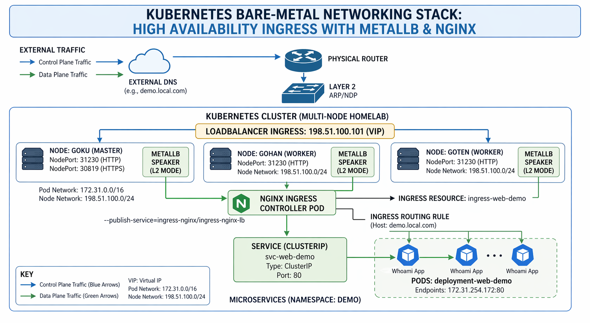

# Kubernetes Bare-Metal Networking Stack 🚀


Production-grade external networking architecture for **bare-metal Kubernetes clusters** using **MetalLB** and **NGINX Ingress Controller**.

This project solves the common on-premise Kubernetes challenge of exposing services externally **without AWS ELB, GCP Load Balancers, or cloud-native integrations**.

---

## 🖼️ Architecture Diagram



---

## 🏗️ About the Project

This repository demonstrates the implementation of a **high-availability ingress and load balancing stack** for bare-metal Kubernetes environments.

Since on-prem clusters do not include native cloud load balancers, this solution uses:

- **MetalLB** for external IP allocation
- **NGINX Ingress Controller** for Layer 7 routing
- **Virtual IP failover** for resilience
- **Cloud-like traffic exposure** on physical infrastructure

The result is a production-style networking model similar to AWS ELB / ALB behavior.

---

## 🏗️ Infrastructure as Code (IaC) Approach

Although this project runs on bare-metal, it follows **Infrastructure as Code (IaC)** principles by using declarative Kubernetes manifests. This approach ensures:

* **Reproducibility:** The entire networking stack can be recreated on any cluster by applying the `/infrastructure` directory.
* **Version Control:** Every change to the network topology or IP pools is tracked via Git history.
* **Consistency:** Eliminates "snowflake" configurations by replacing manual `kubectl` edits with versioned, modular YAML files.

---

## 🛠️ Problem Solved

Traditional bare-metal Kubernetes clusters often depend on:

- `NodePort` services
- Manual port forwarding
- Static IP assignments
- Router NAT rules
- Unreliable failover processes

This project replaces that model with a **Virtual IP (VIP)** architecture where services receive routable external IPs dynamically.

---

## 🧰 Technical Stack

- **Kubernetes**
- **MetalLB** (Layer 2 Mode)
- **NGINX Ingress Controller**
- **Fedora / KVM Virtualization**
- **Helm**
- **SSL/TLS Termination**
- **Pod Security Admission (PSA)**

---

## 🚀 Key Features

- **L2 VIP Failover**  
  Automatic IP migration if a node becomes unavailable.

- **Edge Routing**  
  Single public entry point for multiple internal services.

- **Ingress Status Reporting**  
  Uses `--publish-service` for accurate external IP visibility.

- **Production Style Networking**  
  Simulates cloud provider LoadBalancer behavior on-premise.

- **Scalable Architecture**  
  Easily expandable for additional applications and services.

---

## 📂 Repository Structure

```text
k8s-hybrid-networking-lab/
├── README.md              # Project overview and deployment guide
├── docs/                  # Diagrams, screenshots, architecture assets
├── infrastructure/        # Core networking components
│   ├── metallb/           # IP pools and L2 advertisements
│   └── ingress-nginx/     # LoadBalancer service and controller patch
└── examples/              # Demo workloads
    └── web-demo/
        ├── deployment.yaml
        ├── service.yaml
        └── ingress.yaml
```
---
## ⚙️ Installation & Configuration
### 1️⃣ Install MetalLB

Install MetalLB using Helm:

```bash

helm repo add metallb https://metallb.github.io/metallb
helm repo update

kubectl create namespace metallb-system

helm install metallb metallb/metallb --namespace metallb-system
```
### 2️⃣ Configure MetalLB (Layer 2)

Deploy the networking manifests to handle the IP address assignment in your bare-metal environment:

```bash
kubectl apply -f infrastructure/metallb/
```
---
### 📦 Resources Created

The validation workload deploys the following components to verify the networking stack:

| Resource | Scope | Responsibility |
| :--- | :--- | :--- |
| 🚀 **Deployment** | Internal | Ensures high-availability and manages application replicas. |
| 🔗 **ClusterIP** | Internal | Provides stable internal service discovery for Pods. |
| 🌐 **Ingress** | External | Manages external exposure and hostname-based routing. |
---

### 🔍 Verification Commands

To confirm the resources are running correctly, use:

```bash
# Check the deployment and services
  kubectl get all -n demo

# Verify the External IP assignment
  kubectl get ingress -n demo
```
---
## 🔍 Validation

To verify the deployment and networking stack, run the following commands:

### Verify Ingress external address:
```bash
kubectl get ingress -A
```
---
Once the deployment is complete, verify that **MetalLB** has assigned the External IP and the **Ingress Controller** has published the status:

| NAME | CLASS | HOSTS | ADDRESS | PORTS |
| :--- | :--- | :--- | :--- | :--- |
| ingress-web-demo | nginx | demo.local.com | **198.51.100.101** | 80 |

> [!NOTE]
> The **ADDRESS** field matches your MetalLB IP pool, confirming that the traffic is now routable from your physical network.
---
## 📸 Example Use Cases

This architecture can be applied to multiple real-world scenarios:

- **Internal Developer Platforms** for self-service application deployments  
- **Homelab Production Simulations** for enterprise Kubernetes practice  
- **Kubernetes Networking Labs** for learning ingress and load balancing  
- **On-Premise Application Hosting** without cloud provider dependencies  
- **Hybrid Cloud Edge Routing** connecting local and public environments  

---

## 🧠 What I Learned

This project provided hands-on experience with:

- Designing **bare-metal Kubernetes networking architectures**
- Advertising external Virtual IPs using **ARP / Layer 2**
- Managing **NGINX Ingress Controller** operations
- Building **high availability traffic entry points**
- Structuring repositories with **Infrastructure as Code**
- Implementing **production-grade routing patterns**
- Understanding cloud-like networking on physical infrastructure

---

## 🚀 Future Improvements

Planned next steps for expanding the platform:

- **MetalLB BGP Mode** for advanced routing integrations  
- **Cert-Manager** for automated TLS certificate lifecycle  
- **ExternalDNS** for automatic DNS record management  
- **Prometheus + Grafana** for observability and alerting  
- **GitOps with ArgoCD** for declarative deployments  
- **Multi-cluster Ingress Federation** for scale and resilience

---

## 📜 License

MIT License

---

## 👨‍💻 Author

Built as a real-world Kubernetes infrastructure project focused on DevOps and Platform Engineering. Created by Francisco Tavarez as part of a hands-on engineering portfolio.
